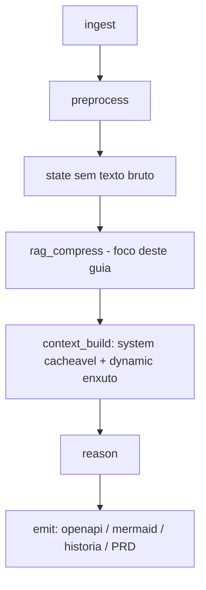
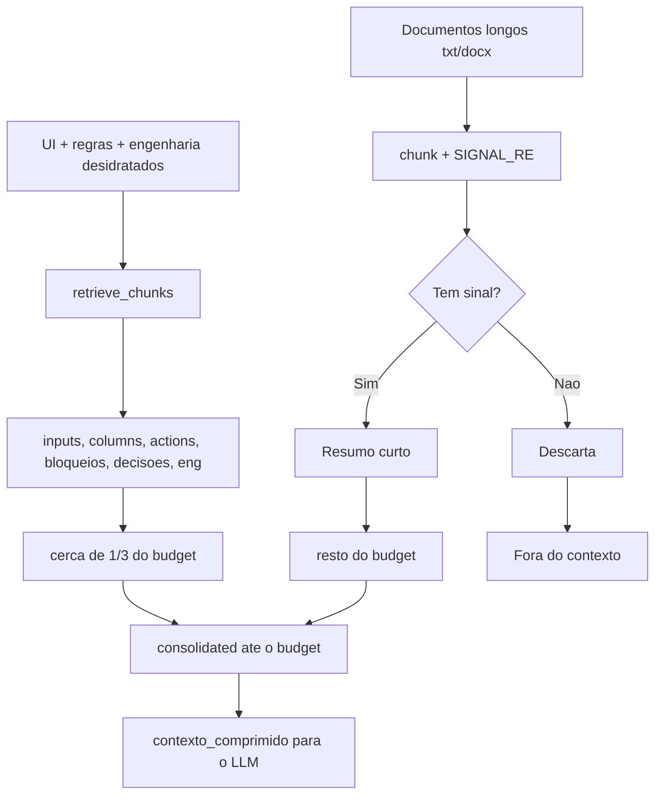
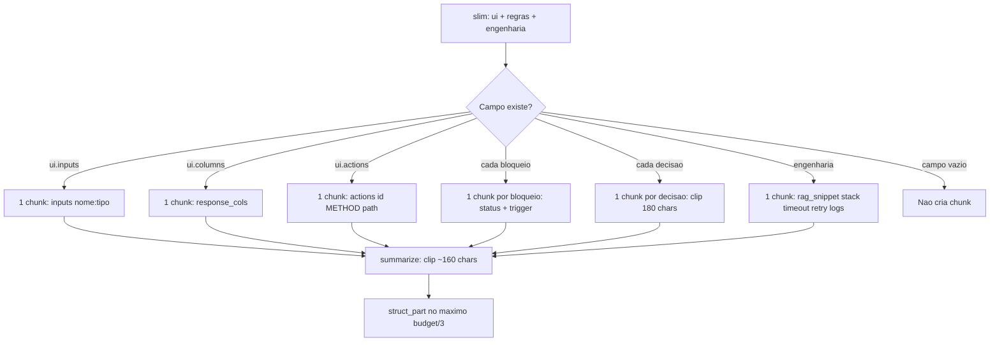
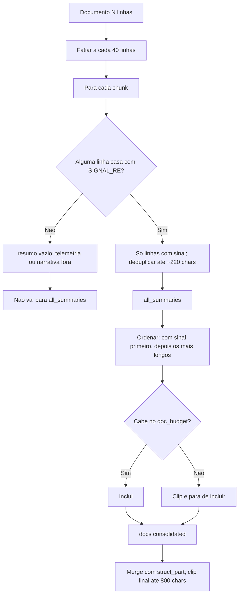
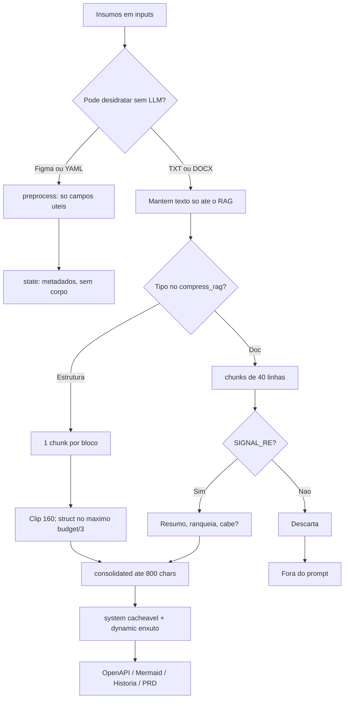
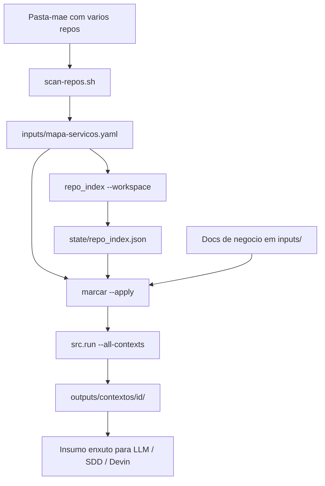

# Prompt-less: RAG e guia de CLI

Guia educativo: o que é o projeto, o que significa RAG neste contexto, como a compressão decide o que entra no modelo, passo a passo dos CLIs (incluindo multi-repo) e catálogo completo dos comandos disponíveis.

**Repositório:** [github.com/ilaraca/prompt-less](https://github.com/ilaraca/prompt-less)

---

## 1. O projeto em uma frase

O **Prompt-less** transforma insumos (Figma, regras, engenharia, docs) em artefatos técnicos (OpenAPI, Mermaid, história, PRD) **sem mandar o texto bruto para o LLM**. O problema que resolve é a **explosão de contexto**; o RAG é o filtro que decide o que o modelo pode “ver”.

### Princípio

> Nunca enviar dados brutos ao modelo se puderem ser filtrados ou comprimidos antes.

### Onde encaixa na arquitetura



---

## 2. O que é RAG — definição clássica vs. este projeto

### Definição clássica

RAG (*Retrieval-Augmented Generation*) é quando o modelo **busca trechos relevantes numa base de conhecimento** antes de responder e **usa esse contexto recuperado** para gerar uma resposta mais precisa e atualizada.

### Em uma frase (neste projeto)

> Neste projeto, RAG é **pegar os insumos da execução (UI, regras, engenharia e docs), filtrar só o que parece sinal de negócio/API, comprimir até o budget e só então entregar esse contexto ao modelo para gerar o artefato**.

### Continua sendo RAG?

**Sim** — ainda é RAG no sentido do padrão **Retrieve → Augment → Generate**.

O que muda é o *como* do Retrieve: aqui **não há embeddings nem busca semântica** numa base grande; o retrieve é **estrutural/lexical** sobre os insumos da pasta `inputs/`. O nome “RAG” continua válido; o adjetivo certo é **RAG comprimido / estrutural**, não o RAG vetorial clássico.

| Etapa RAG clássica | Nesta pipeline |
|--------------------|----------------|
| **Retrieve** | Selecionar e fatiar o que já está nos insumos (UI, regras, docs) |
| **Augment** | Comprimir e juntar num `consolidated` ≤ budget |
| **Generate** | Montar pacote LLM / dry-run scaffold / (futuro) `--live` |

### Analogia rápida

| Abordagem | O que acontece |
|-----------|----------------|
| Sem compressão | Pasta inteira na mala do LLM → caro e barulhento |
| RAG vetorial | Indexa milhares de docs; busca top-k por similaridade |
| **RAG desta pipeline** | Já sabe quais arquivos importam; fatia, filtra sinal lexical, empacota o essencial |

- **RAG desta pipeline:** “pegue estes arquivos desta pasta, fatie, filtre o que parece regra/API, comprima, entregue ao modelo.”
- **RAG vetorial:** “indexe milhares de docs; para esta pergunta, busque os k trechos mais similares semanticamente.”

**Por quê assim?** O corpus por execução é **pequeno e conhecido**. Retrieve estrutural + filtro lexical é mais barato, determinístico e suficiente para controlar tokens. RAG vetorial passa a valer com base grande (wiki, Confluence) e queries variáveis.

---

## 3. Duas esteiras que se juntam



Código: `src/rag_compress.py` (estrutura) + `src/doc_compress.py` (texto longo).

Budget padrão (`config/pipeline.yaml`):

| Config | Valor | Efeito |
|--------|------:|--------|
| `consolidated_summary_max_tokens` | 200 | ≈ **800 chars** no consolidado |
| `rag_chunk_max_tokens` | 120 | Influencia tamanho do resumo por chunk |
| `doc_lines_per_chunk` | 40 | Granularidade do fatiamento de docs |
| `max_context_tokens` | 2000 | Teto do pacote de contexto |
| `target_context_tokens` | 650 | Alvo do pacote final |

Conversão usada no código: **tokens × 4 ≈ chars** (heurística).

---

## 4. Esteira estrutural (`retrieve_chunks`)

Antes do RAG, o `preprocess` já tirou prosa do Figma/YAML. O retrieve só **empacota o que sobrou** em pedaços nomeados.

### Fluxo de decisão



### Matemática do budget

A config `consolidated_summary_max_tokens: 200` vira cerca de **800 caracteres** (heurística tokens × 4).

| Passo | Cálculo | Resultado típico |
|-------|---------|-----------------:|
| Reserva da estrutura | `max(200, 800 / 3)` | **266** chars |
| Budget dos docs | `800 - tamanho(struct_part) - 3` | **~531** chars |
| Merge final | clip do consolidado | **≤ 800** chars |

Em código (`src/rag_compress.py`): primeiro consolida a parte estrutural no teto de ~1/3 do budget; o restante fica para os documentos comprimidos.

A estrutura tem prioridade: UI + bloqueios HTTP são o **contrato mínimo** do artefato; docs só enriquecem.

### Exemplo real (insumos do repositório)

Com `inputs/figma.json` + `regras.yaml` + `engenharia.yaml` saem tipicamente **9 chunks**:

| id | Conteúdo (como entra no RAG) |
|----|------------------------------|
| `ui.inputs` | `inputs[nome:string, email:string, idade:integer, cpf:string]` |
| `ui.columns` | `response_cols[id:string, nome:string, status:string]` |
| `ui.actions` | `actions[salvar:POST/clientes]` |
| `rule.block.0`…`3` | `block status=400 trigger=CPF inválido` (etc.) |
| `rule.decision.0` | `quando=… entao=persistir e retornar 200` |
| `eng.baseline` | `stack_bff=Java 17,Spring Boot 3 timeout_ms=2000 retry=2 …` |

**Decisão de design:** não há ranking semântico. Se o campo existe no slim, **entra**. A “seleção” já aconteceu no preprocess e no clip do budget.

---

## 5. Esteira documental (`doc_compress` + `SIGNAL_RE`)

Compressão hierárquica: bruto → chunks → resumos → consolidado.

### Fluxo de decisão



### O filtro lexical (`SIGNAL_RE`)

Mantém a linha só se aparecer algo como:

`regra` · `bloqueio` · `http` · `endpoint` · `path` · `request` · `response` · `dado` · `quando` · `então` · `auth` · `permiss` · `api` · `bff` · `status` · `openapi` · `fluxo`…

É **léxico**, não semântico: “abatimento” não casa com “desconto”; texto só narrativo pode ser filtrado demais.

### Prova com `amostra_3000.txt`

| Chunk | Decisão | Motivo |
|------:|---------|--------|
| Telemetria (`ruido de telemetria…`) | **DROP** | Sem `SIGNAL_RE` |
| `REGRA bloqueio — … HTTP 400` | **KEEP** | Casa com `regra` / `http` |
| **Total típico** | **~4 keep / ~71 drop** | ~95% dos chunks sumiram |

---

## 6. Fluxograma mestre (assertividade ponta a ponta)



### Perguntas que o RAG responde

| Pergunta | Resposta da pipeline |
|----------|----------------------|
| Vale mandar Figma/YAML bruto? | Não — só campos desidratados |
| Vale mandar parágrafo sem “regra/API”? | Não — `SIGNAL_RE` zera o chunk |
| Estrutura e docs competem por tokens? | Sim — estrutura primeiro; docs no resto |
| Precisa de embedding? | Não neste corpus; só se a base crescer muito |

---

## 7. Números reais (execução de referência)

Com os insumos de exemplo em `inputs/`:

| Métrica | Valor |
|--------|------:|
| Tokens brutos (estrutura + docs) | ~**48 448** |
| Tokens no consolidado | ~**199** |
| Redução documental | **~99,7%** |
| Chunks totais | **~86** (estruturais + docs) |
| `amostra_3000.txt` | 75 chunks → **~4 keep / ~71 drop** |
| Pacote LLM final (`est_tokens`) | ~**600–750** |

Trecho típico do consolidado:

```text
inputs[nome:string, email:string, idade:integer, cpf:string]
| response_cols[id:string, nome:string, status:string]
| actions[salvar:POST/clientes]
| block status=400 trigger=CPF inválido
| …
| REGRA bloqueio — se CPF inválido retornar HTTP 400
| endpoint POST /clientes requestBody …
```

O `state/workflow.json` **não** guarda o texto dos docs — só metadados. Requests seguintes não reenviam dezenas de milhares de tokens.

---

## 8. Como decorar

1. **Estrutura** = contrato obrigatório (sempre tenta entrar).
2. **Docs** = enriquecimento sob filtro lexical (maioria morre).
3. **Budget** = estrutura reserva ~1/3; docs usam o resto; merge final ≤ ~200 tokens.
4. **Generate** só vê o consolidado — nunca as 3000 linhas.

### Limites (para não idealizar)

| Situação | O que acontece |
|----------|----------------|
| Spec só narrativa, sem termos de API | consolidado docs vazio/curto |
| Sinônimo sem raiz comum | filtro erra (léxico ≠ embedding) |
| Muitos bloqueios + eng longa | `struct_part` clipa o excesso |
| Base enorme (wiki/Confluence) | embeddings no Retrieve passam a valer |

Evolução natural: manter `doc_compress` / budget e trocar só o **Retrieve** por embeddings + top-k.

---

## 9. Passo a passo — CLI do projeto

Todos os comandos abaixo assumem o diretório `pipeline/` (raiz deste repositório Prompt-less).

### Passo 0 — Setup (uma vez)

```bash
cd pipeline
python3 -m venv .venv
.venv/bin/pip install -r requirements.txt
```

A partir daqui, use `.venv/bin/python` ou ative o venv:

```bash
source .venv/bin/activate
```

### Passo 1 — Conferir os insumos

O dry-run usa o que estiver em `inputs/`:

| Arquivo | Papel |
|---------|--------|
| `figma.json` | UI (inputs, actions, columns) |
| `regras.yaml` | Fluxo, bloqueios, decisões |
| `engenharia.yaml` | Stack + NFR baseline |
| `*.txt` / `*.md` / `*.docx` | Specs longas (passam pelo RAG documental) |
| `mapa-servicos.yaml` | (opcional) split por microsserviço |

```bash
ls inputs/
wc -l inputs/amostra_3000.txt   # amostra de 3000 linhas inclusa
```

### Passo 2 — Entender o comando principal

```bash
.venv/bin/python -m src.run <tipo> [flags]
```

| Argumento | Valores / efeito |
|-----------|------------------|
| `tipo` | `openapi` · `mermaid` · `historia` · `prd` |
| `--dry-run` | Padrão: gera scaffold **sem** chamar API |
| `--live` | Slot para API (ainda não implementado — `NotImplementedError`) |
| `--context ID` | Só o serviço `ID` (ex.: `ms-cliente`) |
| `--all-contexts` | Um pacote por serviço do mapa |
| `--no-split` | Ignora mapa; emite um único artefato |

A saída no terminal é um JSON com `outputs`, `est_tokens` e `rag` (raw / compressed / redução).

### Passo 3 — Quickstart: história + PRD

```bash
.venv/bin/python -m src.run historia --dry-run
```

O que acontece:

1. Ingest + preprocess dos insumos  
2. RAG comprime UI/regras/docs  
3. Emite **história** e, via `also_emit`, também **PRD**

```bash
ls outputs/historia.md outputs/PRD.md
ls outputs/llm_package_historia.json outputs/llm_package_prd.json
```

JSON típico no terminal:

```json
{
  "outputs": {
    "historia": ".../outputs/historia.md",
    "prd": ".../outputs/PRD.md"
  },
  "est_tokens": 580,
  "rag": { "raw": 48000, "compressed": 150, "doc_reduction_pct": 99.8 }
}
```

### Passo 4 — Pacote técnico completo

```bash
.venv/bin/python -m src.run openapi --dry-run
.venv/bin/python -m src.run mermaid --dry-run
.venv/bin/python -m src.run historia --dry-run
```

| Arquivo | Uso |
|---------|-----|
| `outputs/openapi.yaml` | Contrato de API |
| `outputs/sequence.mmd` | Sequência Frontend → BFF → API |
| `outputs/historia.md` | História BFF/MFE (BDD + NFR) |
| `outputs/PRD.md` | PRD canônico para SDD |

Só o PRD (sem reemitir a história):

```bash
.venv/bin/python -m src.run prd --dry-run
```

### Passo 5 — Provar que o RAG descartou o ruído

```bash
.venv/bin/python -m src.run openapi --dry-run

.venv/bin/python -c "
import json
p = json.load(open('outputs/llm_package_openapi.json'))
d = p['openai']['input']
print('est_tokens', p['meta']['est_tokens'])
print('tem_ruido_telemetria', 'ruido de telemetria' in d)
print('rag', p['meta']['rag_stats'])
"
```

Esperado: `tem_ruido_telemetria` = **False**, `rag.compressed` na casa das centenas (não ~48 000).

### Passo 6 — Inspecionar o pacote LLM

```bash
.venv/bin/python -m src.run mermaid --dry-run

.venv/bin/python -c "
import json
p = json.load(open('outputs/llm_package_mermaid.json'))
print('comando:', p['meta']['comando'])
print('system_chars:', len(p['openai']['instructions']))
print('input_chars:', len(p['openai']['input']))
print('claude_cache:', p['claude']['system'][0].get('cache_control'))
"
```

- **system** = prefixo estável (cacheável)  
- **input** = dynamic enxuto (inclui `contexto_comprimido` do RAG)

### Passo 7 — Ver o estado externo (sem histórico no prompt)

```bash
.venv/bin/python -m src.run historia --dry-run
cat state/workflow.json
```

Deve ter tipo, fluxo, nomes de inputs/bloqueios e metadados de docs — **sem** o corpo das 3000 linhas.

### Passo 8 — Usar seus próprios insumos

```bash
cp ~/Downloads/minha-tela.json inputs/figma.json
cp ~/Downloads/regras-negocio.yaml inputs/regras.yaml
cp ~/Downloads/engenharia-plataforma.yaml inputs/engenharia.yaml   # opcional
cp ~/Downloads/spec-produto.docx inputs/

.venv/bin/python -m src.run historia --dry-run
```

Se o consolidado de docs ficar vazio, enriqueça o texto com termos de regra/API ou ajuste `SIGNAL_RE` em `src/doc_compress.py`.

### Passo 9 — Ajustar budget e reexecutar

Em `config/pipeline.yaml`:

```yaml
budget:
  max_context_tokens: 2000
  consolidated_summary_max_tokens: 200
  doc_lines_per_chunk: 40
```

```bash
.venv/bin/python -m src.run prd --dry-run
```

### Passo 10 — Microsserviços só com o mapa (sem scan de pastas)

Se o `inputs/mapa-servicos.yaml` já existe (ou você editou à mão) e os docs já têm marcadores/keywords:

```bash
.venv/bin/python -m src.run historia --context ms-cliente
.venv/bin/python -m src.run historia --all-contexts
.venv/bin/python -m src.run historia --no-split
```

Para o fluxo completo **pasta de repos → mapa → índice → marcadores → artefatos**, use a [seção 10](#10-multi-repo--várias-pastas-como-insumo).

---

## 10. Multi-repo — várias pastas como insumo

A pasta com vários repositórios **não entra bruta no LLM**. O caminho é: escanear → (indexar) → marcar docs → gerar por serviço.



### 10.1 Organize o workspace

Uma pasta-mãe com um subdiretório por repositório (idealmente git). Nomes com camada no sufixo/prefixo ajudam:

`gestao-de-ofertas-api`, `gestao-de-ofertas-bff`, `cadastro-cliente-mfe`, …

Camadas reconhecidas: `api`, `gtw`, `gateway`, `bff`, `mfe`, `ms`, `svc`, `worker`, `batch`, `orq`, `web`, `front`.

Como o nome é lido:

1. Tokeniza por `-` / `_` / `.` e separa a **camada** do resto  
2. O resto vira a **jornada** (`service_id`, ex.: `gestao-de-ofertas`)  
3. Jornadas contidas em outra são **fundidas** (ex.: `ofertas-gtw` entra em `gestao-de-ofertas`) — desligue com `--no-merge`  
4. `keywords` = slug + tokens significativos + `/ultimo-token` para casar rotas no texto  

### 10.2 Escaneie e gere o mapa

```bash
# só ver o YAML no stdout
./scripts/scan-repos.sh --workspace ~/dev/repos --dry-run

# grava inputs/mapa-servicos.yaml
./scripts/scan-repos.sh --workspace ~/dev/repos
```

| Flag | Quando usar |
|------|-------------|
| `--no-git-check` | Subpastas que não são repo git |
| `--no-merge` | Não fundir jornadas contidas |
| `--out FILE` | Outro caminho para o mapa |
| `--tiers LISTA` | Camadas customizadas |
| `--unassigned bucket` ou `drop` | Chunks não classificados |

### 10.3 Indexe o código (recomendado)

Assim o de/para não depende só do nome da pasta — usa rotas, entidades, status HTTP, stack:

```bash
.venv/bin/python -m src.repo_index --workspace ~/dev/repos
.venv/bin/python -m src.repo_index --show gestao-de-ofertas
```

Saída: `state/repo_index.json`.

### 10.4 Coloque os docs de negócio em `inputs/`

Specs, regras longas, DOCX/TXT/MD — é **isso** que o RAG comprime. O mapa só diz **a qual serviço** cada trecho pertence. Continua valendo `figma.json`, `regras.yaml`, `engenharia.yaml` como baseline.

### 10.5 Marque os docs (de/para)

```bash
.venv/bin/python -m src.marcar --explain
.venv/bin/python -m src.marcar --apply
.venv/bin/python -m src.marcar --apply --convert-binarios   # .docx/.doc
```

Revise `outputs/marcadores_report.json`. Seções genéricas/ruído viram `_unassigned`.

| Flag | Default | Efeito |
|------|--------:|--------|
| `--min-score` | 2.0 | Score mínimo para atribuir |
| `--min-terms` | 2 | Termos distintos exigidos |
| `--min-margin` | 1.3 | 1º precisa superar o 2º |

Marcador manual (`## Serviço: x`) é preservado. Com `--apply`, arquivos `.txt`/`.md` ganham `.bak`.

### 10.6 Valide o mapa

```bash
.venv/bin/python -m src.servicos
.venv/bin/python -m src.servicos --plan
```

### 10.7 Gere artefatos por serviço

```bash
.venv/bin/python -m src.run historia --all-contexts
# → outputs/contextos/<id>/{historia.md,PRD.md}

.venv/bin/python -m src.run historia --context gestao-de-ofertas
```

Cada pasta em `outputs/contextos/<id>/` é o **insumo já filtrado/comprimido** — é o que você manda adiante (SDD, Devin), não o workspace inteiro.

### 10.8 Checklist antes de mandar ao LLM

1. `inputs/mapa-servicos.yaml` — serviços e `repos` batem com as pastas  
2. `outputs/marcadores_report.json` — seções foram para o serviço certo  
3. `outputs/contextos/<id>/` — artefato enxuto; pacote LLM sem texto bruto dos repos  

### 10.9 Atalho: tudo de uma vez

```bash
./scripts/devin-from-promptless.sh --workspace ~/dev/repos --dry-prep
# scan → index → marcar → gerar por serviço → docs/prompt-less em cada repo

./scripts/devin-from-promptless.sh --workspace ~/dev/repos --context gestao-de-ofertas
```

---

## 11. Catálogo completo de CLIs

Todos os comandos abaixo assumem `cd pipeline` e venv pronto (`.venv/bin/python` ou `source .venv/bin/activate`).

### 11.1 Visão geral

| CLI | Módulo / script | Papel |
|-----|-----------------|-------|
| Pipeline principal | `python -m src.run` | Gera openapi / mermaid / historia / PRD |
| Scan de repos | `./scripts/scan-repos.sh` | Pasta de repos → `mapa-servicos.yaml` |
| Índice de código | `python -m src.repo_index` | Lê código → `state/repo_index.json` |
| De/para de docs | `python -m src.marcar` | Injeta `[[service:id]]` nos docs |
| Inspeção do mapa | `python -m src.servicos` | Lista serviços / plano repo×camada |
| Economia de tokens | `python -m src.economia` | Estima custo naive vs Prompt-less |
| Handoff Devin | `./scripts/devin-from-promptless.sh` | Gera + copia + chama Devin |

Ordem típica multi-repo: **scan → repo_index → marcar → servicos (check) → run → (devin)**.

---

### 11.2 `python -m src.run` — gerar artefatos

```bash
.venv/bin/python -m src.run <tipo> [flags]
```

| Argumento | Valores / efeito |
|-----------|------------------|
| `tipo` | `openapi` · `mermaid` · `historia` · `prd` |
| `--dry-run` | Padrão: scaffold **sem** chamar API |
| `--live` | Slot para API (ainda não implementado) |
| `--context ID` | Só o serviço `ID` |
| `--all-contexts` | Um pacote por serviço do mapa |
| `--no-split` | Ignora mapa; um artefato único |

Exemplos:

```bash
.venv/bin/python -m src.run historia --dry-run
.venv/bin/python -m src.run openapi --dry-run
.venv/bin/python -m src.run mermaid --dry-run
.venv/bin/python -m src.run prd --dry-run
.venv/bin/python -m src.run historia --all-contexts
.venv/bin/python -m src.run historia --context ms-cliente
```

Saídas típicas: `outputs/*.md|yaml|mmd`, `outputs/llm_package_*.json`, e com mapa `outputs/contextos/<id>/`.

---

### 11.3 `./scripts/scan-repos.sh` — pasta de repos → mapa

```bash
./scripts/scan-repos.sh --workspace DIR [opções]
```

| Flag | Efeito |
|------|--------|
| `--workspace DIR` | Pasta com todos os repos (**obrigatório**) |
| `--out FILE` | Destino YAML (default: `inputs/mapa-servicos.yaml`) |
| `--tiers LISTA` | Camadas (default: api,gtw,gateway,bff,mfe,ms,…) |
| `--unassigned S` | `bucket` ou `drop` |
| `--no-git-check` | Qualquer subpasta, não só git |
| `--no-merge` | Não funde jornadas contidas |
| `--dry-run` | Imprime YAML; não grava |

Exemplos:

```bash
./scripts/scan-repos.sh --workspace ~/dev/repos --dry-run
./scripts/scan-repos.sh --workspace ~/dev/repos
./scripts/scan-repos.sh --workspace ~/dev/repos --no-git-check --no-merge
```

Depois: `repo_index` → `marcar` → `run --all-contexts`.

---

### 11.4 `python -m src.repo_index` — índice léxico do código

```bash
.venv/bin/python -m src.repo_index --workspace DIR
.venv/bin/python -m src.repo_index --show SERVICE_ID
```

| Flag | Efeito |
|------|--------|
| `--workspace DIR` | Varre os repos do mapa e extrai rotas/entidades/status/stack |
| `--mapa FILE` | Mapa alternativo |
| `--out FILE` | Destino (default: `state/repo_index.json`) |
| `--show ID` | Resumo de um serviço já indexado |

Requer `mapa-servicos.yaml` (gere com `scan-repos.sh` antes). Nada é executado nos repos — só leitura estática (regex).

Exemplos:

```bash
.venv/bin/python -m src.repo_index --workspace ~/dev/repos
.venv/bin/python -m src.repo_index --show gestao-de-ofertas
```

---

### 11.5 `python -m src.marcar` — de/para docs → `[[service:id]]`

```bash
.venv/bin/python -m src.marcar [flags]
```

| Flag | Default | Efeito |
|------|--------:|--------|
| *(sem --apply)* | — | Dry-run: JSON / relatório |
| `--apply` | off | Escreve marcadores (`.bak` ao lado) |
| `--convert-binarios` | off | `.docx`/`.doc` → `<stem>.marcado.md` |
| `--explain` | off | Tabela legível em vez de JSON |
| `--min-score` | 2.0 | Score mínimo |
| `--min-margin` | 1.3 | Margem 1º vs 2º |
| `--min-terms` | 2 | Termos distintos mínimos |
| `--lines-per-chunk` | 40 | Granularidade |
| `--inputs DIR` | `inputs/` | Pasta de docs |
| `--mapa FILE` | mapa padrão | Mapa alternativo |
| `--index FILE` | `state/repo_index.json` | Índice alternativo |

Exemplos:

```bash
.venv/bin/python -m src.marcar --explain
.venv/bin/python -m src.marcar --apply
.venv/bin/python -m src.marcar --apply --convert-binarios --min-score 3
```

Relatório: `outputs/marcadores_report.json`.

---

### 11.6 `python -m src.servicos` — inspecionar o mapa

```bash
.venv/bin/python -m src.servicos
.venv/bin/python -m src.servicos --plan
.venv/bin/python -m src.servicos --mapa inputs/mapa-servicos.yaml
```

| Flag | Efeito |
|------|--------|
| *(padrão)* | Lista os `service_id` do mapa |
| `--plan` | TSV: `service_id` / `repo` / `tier` |
| `--mapa FILE` | Mapa alternativo |

Use depois do `scan-repos` para validar o agrupamento antes de marcar/gerar.

---

### 11.7 `python -m src.economia` — custo naive vs Prompt-less

```bash
.venv/bin/python -m src.economia [flags]
```

| Flag | Default | Efeito |
|------|--------:|--------|
| `--tipo` | `historia` | `openapi` · `mermaid` · `historia` · `prd` |
| `--modelo` | `gpt-4o` | Modelo da tabela de preços |
| `--runs-mes` | 40 | Execuções/mês |
| `--artefatos` | 2 | Artefatos LLM por run (ex.: historia+prd) |
| `--output-tokens` | 1200 | Tokens de saída estimados |
| `--cache-hit` | 0.5 | Fração do prefixo estável no cache (0–1) |
| `--what-if` | off | Cenário hipotético (não lê `inputs/`) |
| `--linhas` | 3000 | Linhas do doc no `--what-if` |
| `--comparar` | off | Tabela por modelo |
| `--json` | off | Saída JSON |
| `--listar-modelos` | off | Lista preços $/1M |

Exemplos:

```bash
.venv/bin/python -m src.economia --listar-modelos
.venv/bin/python -m src.economia --tipo historia --comparar
.venv/bin/python -m src.economia --what-if --linhas 3000 --modelo claude-sonnet
.venv/bin/python -m src.economia --tipo historia --runs-mes 40 --json
```

Modelos típicos: `gpt-4o`, `gpt-4o-mini`, `gpt-4.1`, `claude-sonnet`, `claude-haiku` (confira com `--listar-modelos`).

---

### 11.8 `./scripts/devin-from-promptless.sh` — handoff Devin

A pipeline **gera** contexto curto; o Devin **implementa**. Não aponte o Devin para `inputs/` brutos — só para `outputs/` / `docs/prompt-less/`.

```bash
chmod +x scripts/devin-from-promptless.sh

# Repo único
./scripts/devin-from-promptless.sh /caminho/do/app
./scripts/devin-from-promptless.sh /caminho/do/app --full
./scripts/devin-from-promptless.sh /caminho/do/app --dry-prep
./scripts/devin-from-promptless.sh /caminho/do/app --context ms-cliente --dry-prep

# Workspace com todos os repos
./scripts/devin-from-promptless.sh --workspace ~/dev/repos --dry-prep
./scripts/devin-from-promptless.sh --workspace ~/dev/repos --context gestao-de-ofertas
```

| Flag | Efeito |
|------|--------|
| `APP_ROOT` | Repo único onde o Devin implementa |
| `--workspace DIR` | Escaneia → mapa → marcadores → artefatos por serviço → copia em cada repo |
| `--run` | Default: gera + copia + chama `devin` |
| `--full` | Também openapi + mermaid |
| `--dry-prep` | Só gera e copia (sem chamar Devin) |
| `--context ID` | Só este microsserviço |
| `--all-contexts` | Todos os serviços do mapa |
| `--no-scan` | Reusa `mapa-servicos.yaml` atual |
| `--no-index` | Reusa `state/repo_index.json` |
| `--no-marcar` | Não altera os docs |

Manual (sem script):

```bash
.venv/bin/python -m src.run historia --dry-run
mkdir -p ../meu-app/docs/prompt-less
cp outputs/PRD.md outputs/historia.md ../meu-app/docs/prompt-less/
cd ../meu-app
devin -- "Implemente docs/prompt-less/PRD.md e historia.md. Respeite NFR. Não releia specs brutas."
```

---

## 12. Mapa rápido de arquivos

| Arquivo | Papel no RAG / CLI |
|---------|--------------------|
| `src/run.py` | Orquestração + CLI principal |
| `src/rag_compress.py` | Retrieve estrutural + merge até budget |
| `src/doc_compress.py` | Chunks + `SIGNAL_RE` + consolidado docs |
| `src/preprocess.py` | Desidrata UI/regras/engenharia |
| `src/context_builder.py` | system estável + dynamic com `contexto_comprimido` |
| `src/reason.py` | Pacote LLM + dry-run scaffold |
| `src/emit.py` | Grava artefatos em `outputs/` |
| `src/repo_index.py` | Índice léxico dos repos |
| `src/marcar.py` | De/para → marcadores nos docs |
| `src/servicos.py` | Inspeciona `mapa-servicos.yaml` |
| `src/economia.py` | Calculadora de economia de tokens |
| `config/pipeline.yaml` | Budget e `also_emit` |
| `scripts/scan-repos.sh` | Pasta de repos → mapa de serviços |
| `scripts/devin-from-promptless.sh` | Prompt-less → Devin |

Leitura recomendada do código: `run.py` → `rag_compress.py` → `doc_compress.py` → `context_builder.py`.  
Fluxo multi-repo: `scan-repos.sh` → `repo_index.py` → `marcar.py` → `run.py`.

---

## Referência

Detalhes de arquitetura, insumos e economia de tokens: ver o [README.md](../README.md) na raiz do pipeline.
